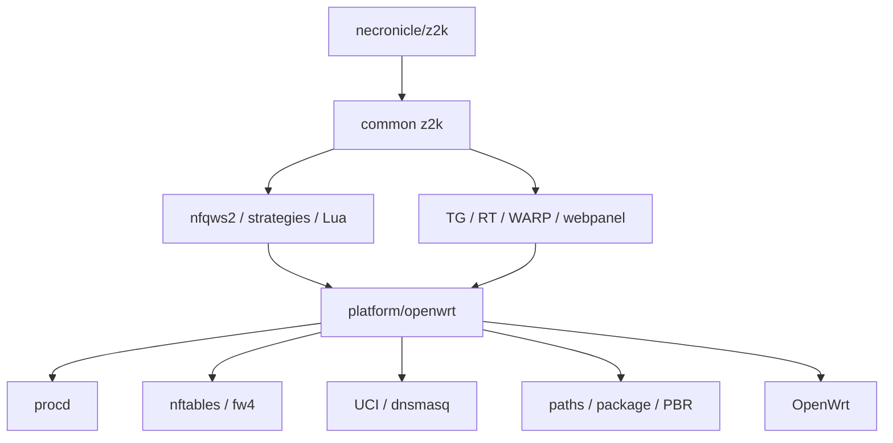

<div align="center">

<h1>z2kOW</h1>

<p><strong>z2k для OpenWrt через тонкий platform adapter</strong></p>

[](https://github.com/t0fox/z2kOW/actions/workflows/ci.yml)
[](https://openwrt.org/)
[](./docs/openwrt-adapter-contract.md)
[](./package/openwrt/)
[](./LICENSE)

<p>
  <a href="#быстрый-старт"><strong>Быстрый старт</strong></a>
  ·
  <a href="#как-пользоваться-z2k"><strong>Гайд</strong></a>
  ·
  <a href="./docs/openwrt-adapter-contract.md"><strong>Архитектура</strong></a>
  ·
  <a href="https://github.com/t0fox/z2kOW/actions/workflows/ci.yml"><strong>CI</strong></a>
</p>

</div>

**Telegram-группа: [@zapret2keenetic](https://t.me/zapret2keenetic)** — вопросы, помощь с настройкой, обсуждение

> [!IMPORTANT]
> Сейчас z2kOW находится на этапе **live acceptance**. Реальные APK уже собираются pinned OpenWrt SDK 25.12.5 и полностью проходят CI, resolver и isolated-root install. Следующий этап — проверка на реальном Cudy WR3000 v1. До неё CI snapshot считается тестовой сборкой, а не публичным production-релизом.

## Что это

**z2kOW** — OpenWrt-адаптация [necronicle/z2k](https://github.com/necronicle/z2k), сделанная не как отдельный форк, а как слой совместимости платформы.

Общая логика z2k остаётся общей:

- стратегии и autocircular;
- Lua;
- списки;
- Telegram transport;
- RT proxy;
- WARP engine;
- updater;
- webpanel.

OpenWrt-специфика вынесена отдельно:

- `procd` вместо Keenetic init;
- `nftables/fw4` вместо platform-specific firewall glue;
- `UCI/dnsmasq` вместо `ndmc`;
- OpenWrt paths;
- APK/package lifecycle;
- PBR/mark translation.

Идея проекта простая:

```text
upstream z2k
      │
      │ common logic почти без изменений
      ▼
OpenWrt compatibility adapter
      │
      ├── procd
      ├── nft/fw4
      ├── UCI/dnsmasq
      ├── OpenWrt filesystem
      └── package/update glue
```

## Текущее состояние

| Контур | Статус |
|---|:--:|
| Foundation / bootstrap / lifecycle | **PASS** |
| Core z2k + nft/NFQUEUE | **PASS** |
| Telegram + CDN | **PASS** |
| RuTracker RT proxy | **PASS** |
| WARP | **PASS** |
| Webpanel | **PASS** |
| Real APK build | **PASS** |
| `packages.adb` + resolver | **PASS** |
| Go / reproducible binaries | **PASS** |
| Live Cudy WR3000 v1 | **PENDING** |
| Production feed/signing | **PENDING** |

Последний полностью зелёный CI: commit `dca297c`.

---

# Быстрый старт

> [!WARNING]
> До завершения live acceptance ниже используется **CI snapshot**. Для него допустим локальный `--allow-untrusted`. Это не финальная схема production-установки.

## 1. Совместимость

Текущий build contract:

| Параметр | Значение |
|---|---|
| OpenWrt | **25.12.5** |
| Target | **`mediatek/filogic`** |
| Arch | **`aarch64_cortex-a53`** |
| Package format | **APK v3** |
| Test device | **Cudy WR3000 v1** |
| Adapter API | **1** |

## 2. Скачай CI artifact

Открой зелёный workflow **CI** для `feat/openwrt-adapter` и скачай artifact вида:

```text
z2k-openwrt-CI-SNAPSHOT-<commit>
```

Внутри:

```text
z2k-adapter-0.1.0-r8.apk
z2k-webpanel-0.1.0-r8.apk
z2k-zapret2-runtime-1.0.5.1-r4.apk
packages.adb
sha256sums
provenance.json
METADATA.txt
```

Перед установкой сверь SHA256.

Upgrade одной операцией: `apk upgrade z2k-webpanel` (или `apk add
z2k-webpanel`) — versioned EXTRA_DEPENDS заставляют резолвер co-upgrade'ить
adapter, а runtime приезжает dependency resolver'ом сам. Runtime вручную
не перечислять (доказано CI upgrade-регрессией против версий фида).

## 3. Установи core

Скопируй APK на роутер и выполни:

```sh
apk add --allow-untrusted ./z2k-adapter-0.1.0-r8.apk
```

Затем:

```sh
/etc/init.d/z2k enable
/etc/init.d/z2k start
```

Быстрая проверка:

```sh
/etc/init.d/z2k status
ubus call service list '{"name":"z2k"}'
nft list table inet zapret
```

## 4. Установи webpanel

```sh
apk add --allow-untrusted ./z2k-webpanel-0.1.0-r8.apk
/etc/init.d/z2k-webpanel enable
/etc/init.d/z2k-webpanel start
```

По умолчанию панель слушает LAN-адрес роутера на:

```text
http://<LAN-IP>:8088
```

Stock lighttpd OpenWrt не используется и не перенастраивается — у панели свой dedicated instance.

---

# Как пользоваться z2k

Ниже — именно пользовательский гайд z2k, но уже для OpenWrt.

## Основное управление

| Действие | Команда |
|---|---|
| Старт | `/etc/init.d/z2k start` |
| Стоп | `/etc/init.d/z2k stop` |
| Рестарт | `/etc/init.d/z2k restart` |
| Reload | `/etc/init.d/z2k reload` |
| Статус | `/etc/init.d/z2k status` |
| Автозапуск включить | `/etc/init.d/z2k enable` |
| Автозапуск выключить | `/etc/init.d/z2k disable` |

Главный конфиг:

```text
/etc/z2k/config
```

Persistent state:

```text
/etc/z2k/state/
```

Пользовательские списки и кастомные настройки:

```text
/etc/z2k/user-lists/
```

Runtime/logs:

```text
/tmp/z2k/
```

## Что происходит при старте

`/etc/init.d/z2k` выполняет один общий lifecycle:

```text
bootstrap
  ↓
генерация config
  ↓
nfqws2
  ↓
nft/NFQUEUE
  ↓
Telegram/CDN
  ↓
RT proxy
  ↓
WARP desired-state
```

Все процессы принадлежат одному procd-сервису `z2k`.

## Webpanel

Панель остаётся той же по логике, что upstream z2k: frontend и CGI не переписаны под LuCI.

На OpenWrt добавлен только adapter:

```text
upstream webpanel
      ↓
webpanel/cgi/platform.sh
      ↓
platform/openwrt/webpanel.sh
      ↓
procd / nft / UCI / existing feature adapters
```

Через панель доступны:

- статус core;
- start/stop/restart;
- стратегии;
- whitelist;
- extra domains;
- исключения;
- custom strategies;
- Telegram;
- WARP;
- проверка/применение обновлений;
- состояние updater;
- neighbor list для WARP.

Keenetic-only controls, у которых нет OpenWrt-эквивалента, не эмулируются фальшиво:

| Функция | OpenWrt |
|---|:--:|
| Keenetic policy | Нет |
| PPE toggle Keenetic | Нет |
| Full uninstall из браузера | Нет |
| WARP | Да |
| Telegram | Да |

Полное удаление делается пакетным менеджером, а не CGI.

---

# Стратегии и autocircular

Главная логика z2k здесь такая же, как upstream.

Для разных типов трафика используются отдельные strategy pools:

- RKN / обычный TCP/TLS;
- YouTube TCP;
- GoogleVideo TCP;
- YouTube QUIC;
- Discord UDP.

В профиле может быть несколько стратегий:

```text
strategy=1
strategy=2
strategy=3
...
```

Модуль `circular` отслеживает успех и неудачи и при необходимости переходит к следующему варианту.

### Что это значит для пользователя

После первого запуска сайт не обязан заработать именно с первой попытки.

Если конкретный домен попал под autocircular, z2k может потребоваться несколько соединений, чтобы подобрать рабочую стратегию.

То есть нормальный сценарий:

```text
первый запрос не прошёл
→ circular считает неудачу
→ следующий strategy
→ новый запрос
→ успешный strategy закрепился
```

Состояние сохраняется в persistent state и переживает рестарты:

```text
/etc/z2k/state/state.tsv
```

Поэтому после обучения система не должна начинать подбор заново при каждом reboot.

## Custom strategies

Пользовательские стратегии на OpenWrt хранятся отдельно от updater-owned payload:

```text
/etc/z2k/user-lists/custom-strategies/
```

Они не должны исчезать после обычного update или APK upgrade.

Если custom strategy задана для конкретного pool, она перекрывает shipped strategy этого pool.

---

# Домены, whitelist и исключения

Updater-owned списки:

```text
/usr/lib/z2k/lists/
```

Пользовательские:

```text
/etc/z2k/user-lists/
```

Основные файлы:

| Файл | Назначение |
|---|---|
| `/etc/z2k/user-lists/extra-domains.txt` | Домены, которые нужно добавить в обработку |
| `/etc/z2k/user-lists/whitelist.txt` | Домены, которые не нужно обходить |
| `/etc/z2k/user-lists/exclude.txt` | Пользовательские исключения |
| `/etc/z2k/user-lists/custom-strategies/` | Собственные стратегии |
| `/etc/z2k/user-lists/warp/` | WARP lists/devices |

Эти файлы — user-owned. Updater не должен затирать их shipped-версиями.

Править их руками можно: одна запись на строку, комментарии после `#` и пустые строки не мешают.

После изменения через webpanel нужный reload/restart выполняется самим backend.

---

# Telegram + CDN

Telegram реализован как отдельный procd instance внутри сервиса z2k.

Один `tg-mtproxy-client` обслуживает:

```text
:1443  Telegram
:1444  CDN
```

Вручную клиентские устройства настраивать не нужно — adapter делает transparent routing.

Управлять проще всего из webpanel.

Ручной флаг:

```text
TG_PROXY_USER_DISABLED=0   # включено
TG_PROXY_USER_DISABLED=1   # выключено
```

в:

```text
/etc/z2k/config
```

После изменения:

```sh
/etc/init.d/z2k reload
```

Проверка процесса:

```sh
ubus call service list '{"name":"z2k"}'
```

Telegram adapter не создаёт вторую nft-таблицу — его chains/sets живут внутри `inet zapret`.

---

# RuTracker RT proxy

RT proxy — first-class feature того же core lifecycle.

Поддерживаемые домены:

```text
rutracker.org
rutracker.wiki
api.rutracker.cc
rep.rutracker.cc
static.rutracker.cc
```

IPv4 sentinel:

```text
10.171.171.171
```

IPv6 sentinel:

```text
2001:db8::1:1445
```

HTTPS traffic направляется на локальный transparent proxy `:1445`.

Пользователю не нужно отдельно держать второй init-сервис или firewall script: RT запускается и сходится вместе с `z2k`.

---

# WARP

WARP предназначен для трафика, который нельзя нормально обойти только desync-стратегиями — прежде всего IP-based сценариев и игровых сетей.

WARP **не ставится автоматически** вместе с core.

## Установить engine

```sh
/usr/lib/z2k/platform/openwrt/warp.sh install
```

Эта команда:

- скачивает правильный binary для архитектуры;
- регистрирует устройство;
- сохраняет identity;
- не включает routing автоматически.

Identity:

```text
/etc/z2k/state/warp/device.json
```

## Включить

```sh
/usr/lib/z2k/platform/openwrt/warp.sh enable
```

## Статус

```sh
/usr/lib/z2k/platform/openwrt/warp.sh status
```

## Выключить

```sh
/usr/lib/z2k/platform/openwrt/warp.sh disable
```

## Удалить engine

```sh
/usr/lib/z2k/platform/openwrt/warp.sh remove
```

При remove сохраняются:

- device identity;
- user lists.

Маршрутизация WARP:

```text
fwmark 0x80000000/0x80000000
rule pref 500
table 989
```

Если tunnel не ready, adapter fail-open: PBR снимается, dynamic rules очищаются, обычный трафик не должен blackhole'иться.

---

# Обновления

В z2kOW два независимых канала доставки.

## Payload update

Обычные изменения:

- Lua;
- strategies;
- lists;
- common libs;
- webpanel assets;
- binaries;

идут через подписанный z2k updater.

Проверить:

```sh
/usr/lib/z2k/platform/openwrt/update.sh check
```

Применить вручную:

```sh
Z2K_AU_MANUAL=1 /usr/lib/z2k/platform/openwrt/update.sh apply
```

Ручной apply не ждёт nightly jitter.

## Подпись обновлений

Манифест обновлений подписывается, роутер проверяет подпись перед применением. Приватного ключа в репозитории нет.

Публичный ключ едет вместе с установкой (`files/etc/z2k-update-pub.pem`). Его отпечаток:

```
1041720fa0dff53e2babbf547a705c2f43c30bca2c6ca2ddf7144cfe3b470a01
```

Если ключ придётся сменить, установка покажет отпечаток нового ключа — сверьте с этим. Не совпал — не подтверждайте.

## APK update

Если меняется сам OpenWrt adapter:

```text
platform/openwrt/*
init.d
hotplug
package metadata
adapter API
```

нужен новый `z2k-adapter.apk`.

Это происходит значительно реже.

Главное правило:

```text
обычный upstream z2k update
→ НЕ требует пересборки APK
```

---

# Проверка состояния

## Core

```sh
/etc/init.d/z2k status
ubus call service list '{"name":"z2k"}'
```

## nft/NFQUEUE

```sh
nft list table inet zapret
```

## Routes и marks

```sh
ip rule
ip route show table all
```

## Webpanel

```sh
/etc/init.d/z2k-webpanel status
```

Если panel не стартует:

```sh
logread | grep -i z2k
logread | grep -i lighttpd
```

## Updater

```sh
/usr/lib/z2k/platform/openwrt/update.sh check
```

Логи и transient state:

```text
/tmp/z2k/logs/
/tmp/z2k/runtime/
/tmp/z2k/warp/
```

---

# Если сайт не открывается

Порядок проверки:

1. Убедись, что core действительно запущен.
2. Проверь `inet zapret`.
3. Сделай несколько новых соединений/перезагрузок страницы — autocircular может подбирать strategy.
4. Если домена нет в shipped lists, добавь его в:
   ```text
   /etc/z2k/user-lists/extra-domains.txt
   ```
5. Если сайт ломается именно из-за обработки z2k — добавь его в whitelist/exclude.
6. После изменения списка выполни reload через webpanel или:
   ```sh
   /etc/init.d/z2k reload
   ```
7. Посмотри logs:
   ```sh
   logread | grep -i z2k
   ```

Не начинай сразу менять nft rules вручную: firewall state принадлежит adapter/runtime и при следующем converge ручная правка всё равно будет заменена.

---

# Если после включения WARP пропал интернет

Проверь:

```sh
/usr/lib/z2k/platform/openwrt/warp.sh status
ip rule
ip route show table 989
nft list table inet zapret
```

Нормальная fail-open модель:

```text
WARP not ready
→ PBR removed
→ dynamic TUN rules empty
→ обычный интернет продолжает работать
```

Если это не так — это уже runtime defect, а не ожидаемое поведение.

---

# Webpanel не открывается

Проверить:

```sh
/etc/init.d/z2k-webpanel status
logread | grep -i lighttpd
```

По умолчанию порт:

```text
8088
```

Настройки панели:

```text
/etc/z2k/webpanel/
```

Сгенерированный lighttpd config transient:

```text
/tmp/z2k/runtime/webpanel/lighttpd.conf
```

Если `8088` уже занят чужим процессом, z2k-webpanel специально не убивает его и не подменяет конфиг — старт завершается ошибкой.

---

# Удаление и переустановка

Webpanel:

```sh
apk del z2k-webpanel
```

Core:

```sh
apk del z2k-adapter
```

По контракту uninstall сохраняет пользовательские данные:

```text
/etc/z2k/config
/etc/z2k/state/
/etc/z2k/user-lists/
/etc/z2k/webpanel/
```

Это позволяет установить пакет снова и не потерять config, WARP identity и user lists.

После переустановки healthy payload не должен откатываться к старому seed.

---

# Что пока не переносится с Keenetic

Не каждая upstream-кнопка имеет смысл на OpenWrt.

Сейчас намеренно нет отдельной эмуляции:

- Keenetic NDM policy;
- Keenetic PPE toggle;
- full package uninstall из browser;
- Keenetic-specific `ndmc` tools.

Если feature не имеет честного OpenWrt-equivalent, она скрывается/отключается, а не имитируется пустышкой.

---

# Runtime layout

| Путь | Класс | Что лежит |
|---|---|---|
| `/usr/lib/z2k/` | payload | common z2k |
| `/usr/lib/z2k/platform/openwrt/` | package | adapter |
| `/usr/lib/z2k/bin/` | updater | binaries |
| `/etc/z2k/config` | user | config |
| `/etc/z2k/state/` | persistent | autocircular/updater/WARP state |
| `/etc/z2k/user-lists/` | user | whitelist, extra domains, WARP lists |
| `/etc/z2k/webpanel/` | user | настройки panel |
| `/tmp/z2k/` | transient | logs/runtime/downloads/generated |

Package-owned и updater-owned части разделены.

---

# Архитектура



Canonical firewall table:

```text
inet zapret
```

Feature adapters добавляют свои chains/sets в неё, но не создают параллельный firewall framework.

---

# CI и сборка

CI проверяет:

- ShellCheck;
- Lua tests;
- Go `gofmt`, `vet`, race tests и cross-compile;
- byte-for-byte reproducibility shipped binaries;
- OpenWrt test harness;
- pinned OpenWrt 25.12.5 SDK;
- real APK build;
- APK v3 metadata;
- `packages.adb`;
- ephemeral signing;
- wrong-key/tamper rejection;
- isolated-root dependency resolution.

Полный OpenWrt harness:

```sh
sh tests/openwrt/run.sh
```

Package builder:

```sh
sh scripts/openwrt/build-release.sh --ci-snapshot ...
```

Manifest generator:

```sh
sh scripts/openwrt/gen-openwrt-manifest.sh ...
```

---

## Огромная благодарность спонсорам проекта

- **SupWgeneral**
- **Alexey**
- **Jet_sk_ya**
- **Suharik39**
- **ZyaK<-**
- **Алексей Стрельцов**
- **Diman86RUS**
- **Alex**
- **GRM**
- **Dez**
- **hoaxx**
- **Mansurchick**
- **Dkarloff - SEO отец**
- **KIBERPANK**
- **olmer2002**
- **TiaMax**
- **Denis**
- **Mega Man**
- **TheGreatYogo**
- **logistik77**
- **b11d11**
- **BloodKnife39**
- **SIGogelon**
- **yozh**
- **Altaec**
- **DIDIQ Rawa**

**Windows:** если на iPhone или Mac сайты открываются, а на компьютере с Windows висят — [включите метки времени TCP одной командой](#4-windows-если-сайты-висят-и-не-открываются).

# Документация

| Документ | Назначение |
---

## Что это

z2k — модульный установщик zapret2 для роутеров Keenetic с Entware.

Цель проекта: упростить установку zapret2 на Keenetic и предоставить набор сетевых стратегий с автоподбором (autocircular), персистентной памятью, телеметрией и полной поддержкой IPv4/IPv6.

---

## Особенности

### Сетевые стратегии

- Установка zapret2 (openwrt-embedded релиз) без компиляции, с проверкой работоспособности `nfqws2`
- Три TCP autocircular профиля с разными стратегиями:
  - **RKN** — список ресурсов (TCP/TLS + HTTP) — 50 стратегий
  - **YouTube TCP** — youtube.com и связанные домены — 22 стратегии
  - **YouTube GV** — googlevideo CDN (стриминг) — 22 стратегии
- QUIC autocircular профили: YouTube QUIC (UDP/443) и Discord voice — с z2k morph-стратегиями (QUIC morph / timing morph)
- Discord профили:
  - TCP: hostlist Discord включён в RKN-профиль
  - UDP voice/video: `circular` — стратегия закрепляется в `state.tsv` после первого успеха и удерживается между перезапусками
- Hostlist режим: стратегии применяются только к доменам из списков
- **Автохостлист** (меню `[L]`) — режим, в котором движок сам находит заблокированные домены и дописывает их в список, вместо работы по готовым спискам
- Исключения: то, что z2k не трогает вообще. По домену — госуслуги, банки, Steam / PlayStation / Nintendo / Epic, VK, Яндекс и другие (список поставляется готовым и пополняется вручную). По адресу или подсети — для того, у чего имени в трафике нет: камеры и домофоны с P2P, часть VoIP и видеозвонков

### Сеть и прокси

- **Telegram** — прозрачная работа для всех устройств в сети, без настройки на клиентах (кроме роутеров на Realtek Lexra — [почему](#telegram))
- **IPv6** — полная поддержка: dual-stack DNS, IPv6 SO_ORIGINAL_DST, Telegram DC IPv6 CIDR
- **Игровой режим (WARP)** — игры, заблокированные по IP (не по домену), обходятся через split-туннель Cloudflare WARP на собственном движке z2k; списки игровых IP/CIDR и устройства «целиком в WARP» настраиваются в вебморде. Ставится только по кнопке. Подробнее — раздел [«Игровой режим (WARP)»](#игровой-режим-warp) ниже.

### Инструменты и мониторинг

- **Веб-панель** — управление и мониторинг через браузер: статус и запуск сервиса, стратегии, списки, диагностика с проверкой отдельного домена, обновление и удаление z2k. Можно включить вход по паролю — тому же, что у веб-интерфейса роутера. Открывается без интернета: шрифты и всё остальное лежат на самом роутере, ни одного обращения наружу
- **Config validator** — валидация конфигурации перед применением (порты, hostlist-файлы, blob-файлы, lua-desync)
- **Rollback** — откат конфигурации к предыдущему snapshot
- **Планировщик** — обновление списков доменов и обслуживающие задачи по расписанию (заменяет cron, который на Entware ненадёжен)
- **Сбор статистики** — анонимная отправка обезличенных данных о том, какие стратегии срабатывают; включён по умолчанию, выключается в меню `[C]`

---

## Установка

### 1) Компоненты прошивки Keenetic

**«Модули ядра подсистемы Netfilter» нужны на ЛЮБОЙ прошивке Keenetic** — по умолчанию они не предустановлены, и без них z2k не запустится. Их нужно доустановить в веб-интерфейсе Keenetic (раздел «Изменить набор компонентов»):

1. **«Модули ядра подсистемы Netfilter»** — обязательно, на всех прошивках и роутерах.
2. **«Протокол IPv6»** — нужен только на старых прошивках (и только если вы используете IPv6). На новых прошивках IPv6 уже включён по умолчанию, и такого пункта в списке может не быть.

На части прошивок пункт «Модули ядра подсистемы Netfilter» появляется в списке только после того, как выбран компонент «Протокол IPv6».

### 2) Подготовка USB и установка Entware (обязательно)

Подготовьте USB-накопитель и установите Entware по официальной инструкции Keenetic:
https://help.keenetic.com/hc/ru/articles/360021214160

После установки Entware выполните обновление индекса пакетов и установите зависимости:

```bash
opkg update
opkg install coreutils-sort curl grep gzip ipset iptables kmod_ndms xtables-addons_legacy openssl-util
```

### 3) Установка z2k

```bash
{ curl --resolve raw.githubusercontent.com:443:213.176.74.63 -fsSL https://raw.githubusercontent.com/necronicle/z2k/z2k-enhanced/z2k.sh || curl -fsSL https://raw.githubusercontent.com/necronicle/z2k/z2k-enhanced/z2k.sh; } | sh
```

### 4) Windows: если сайты висят и не открываются

Если на iPhone или Mac сайты открываются, а на Windows-компьютере долго грузятся и падают, включите в Windows метки времени TCP. Откройте командную строку от имени администратора и выполните:

```
netsh interface tcp set global timestamps=enabled
```

Вернуть как было:

```
netsh interface tcp set global timestamps=disabled
```

Зачем это нужно: часть стратегий портит метку времени в поддельном пакете, чтобы сервер его отбросил. В Windows метки по умолчанию выключены, поэтому сервер принимает подделку, и соединение зависает. На iPhone и Mac метки включены, там всё работает. От блокировки по IP это не помогает.

---

## Меню

Меню открывается **той же командой, что и установка** — если z2k уже установлен, она просто открывает меню (а если ещё нет — ставит и открывает):

```bash
{ curl --resolve raw.githubusercontent.com:443:213.176.74.63 -fsSL https://raw.githubusercontent.com/necronicle/z2k/z2k-enhanced/z2k.sh || curl -fsSL https://raw.githubusercontent.com/necronicle/z2k/z2k-enhanced/z2k.sh; } | sh
```

| Пункт | Описание |
|---|---|
| [OpenWrt adapter contract](./docs/openwrt-adapter-contract.md) | Platform boundary и ownership |
| [Foundation state machine](./docs/openwrt-foundation-state-machine.md) | Seed/tag/bootstrap |
| [Mark allocation](./docs/openwrt-mark-allocation.md) | fwmark allocation |
| [Telegram contract](./docs/openwrt-telegram-contract.md) | TG/CDN |
| [RT proxy contract](./docs/openwrt-rt-proxy-contract.md) | RuTracker |
| [WARP contract](./docs/openwrt-warp-contract.md) | WARP/PBR |
| [Webpanel contract](./docs/openwrt-webpanel-contract.md) | Panel adapter |
| [Release contract](./docs/openwrt-release-contract.md) | APK/payload lanes |
| [ARCHITECTURE.md](./ARCHITECTURE.md) | Общая архитектура z2k |
| [RELEASING.md](./RELEASING.md) | Release lifecycle |
| [SECURITY.md](./SECURITY.md) | Trust/signature model |

---

# Upstream и связанные проекты

| Проект | Связь |
|---|---|
| [necronicle/z2k](https://github.com/necronicle/z2k) | Основной upstream |
| [necronicle/zapret2-z2k](https://github.com/necronicle/zapret2-z2k) | `nfqws2` / zapret2 runtime |
| [OpenWrt](https://openwrt.org/) | Целевая платформа |
| [t0fox/zapret2-manager](https://github.com/t0fox/zapret2-manager) | Отдельный OpenWrt manager-проект |

z2kOW не пытается заменить upstream z2k. Его задача — дать z2k OpenWrt-платформу с минимальным количеством локальных platform seams.
---

## Как работает autocircular

Каждый TCP/QUIC профиль содержит N стратегий с номерами `strategy=1..N`. Модуль `circular` в nfqws2 отслеживает успех/неудачу per-domain и переключается на следующую стратегию при неудаче. Успех сбрасывает счётчик неудач; текущая стратегия сохраняется до следующего кворума провалов.

> **Аппаратный офлоад Keenetic.** На части устройств (особенно ТВ-приставках и Smart TV) NAT-офлоад уводил соединение мимо conntrack, из-за чего десинк к нему не применялся и сайт молча не открывался, а ротация «залипала». z2k при старте сервиса выключает софт-фастпас (`nf_conntrack_fastnat`), поэтому обход и автоподбор стратегий работают и на офлоадных устройствах.

### Детекция неудач

Базовые RST, исходящие ретрансмиссии и пороги прогресса обслуживает
`zapret-auto.lua`. `z2k-alert.lua` добавляет разбор ранних TLS/HTTP-ответов,
а `z2k-quic-silence.lua` — ограниченное по времени наблюдение QUIC v1/v2.

- **TCP:** две ретрансмиссии байтов первого запроса (`retrans=2`,
  `maxseq=32768`) или входящий RST в первых 4 КБ (`inseq=4096`).
  Продолжения ClientHello/HTTP-заголовков учитываются, повторы последующих
  запросов и входящие ретрансмиссии сами по себе не вызывают ротацию.
- **TLS:** открытый fatal alert до ServerHello считается неудачей, в том числе
  при разделении записи между пакетами. Зашифрованные записи и алерты после
  ServerHello этим правилом не классифицируются.
- **HTTP:** неудачей считаются редиректы на явно перечисленные порталы
  блокировки и характерные маркеры в 4xx/5xx. Заголовки и начало тела собираются
  в пределах 4096 байт. Обычные ошибки и редиректы на другой сайт нейтральны;
  2xx/304 и редирект на тот же хост сбрасывают счётчик неудач.
- **QUIC в пуле `quic`:** один Initial запускает таймер на 5 с.
  Новый этап рукопожатия продлевает ожидание, но суммарно не более 15 с.
  Retry, Initial и произвольный UDP-ответ не означают успех. Наблюдаемый обмен
  short-header пакетами в обе стороны завершает проверку успешно; исчерпание
  окна перехвата — нейтрально. Пределы окна передаются генератором конфигурации.
  Неизвестные версии QUIC и остальные UDP-пулы используют штатные счётчики.
- **Штатный успех:** TCP-пакет с новыми данными за `inseq`/`maxseq`, без RST/FIN;
  для UDP — число входящих пакетов выше `udp_in`. Это признаки транспортного
  прогресса, а не гарантия работающего приложения.
- **Ротация:** три неудачи с зазором не более 60 с (`fails=3`, `time=60`),
  для видео — 300 с. Соединение сохраняет стратегию, выбранную при его начале.
  Ротация выбирает стратегию для новых соединений; результаты старого поколения
  не меняют её счётчики, даже после полного обхода круга.
- **`reset`:** RST клиенту отправляется только после принятой неудачи по
  исходящим ретрансмиссиям. Отключается через `Z2K_CIRCULAR_RESET=0`.

Пороги и проводка сейчас экспериментальные; сетевой прогон на роутере ещё
не заменён результатами Lua-тестов. `retrans=2` не меняет кворум `fails=3`.
Ретрансмиссии не задают фиксированное число секунд до решения.

Состояние ведётся по полному hostname. Только поддомены `googlevideo.com`
в GV/QUIC (и объединённом Google-профиле) используют общий ключ CDN.
Старые агрегированные записи автоматически не распространяются на поддомены:
части хостов потребуется повторный подбор и повторное ручное закрепление.

Состояние IPv4/IPv6 разделено (`family_split`). Таймерная ротация сохраняется
на диск и без следующего пакета. Слой сохранения больше не отменяет ротацию
по недавнему успеху соседнего соединения; явное закрепление оператором сохраняется.

TTL и несколько ответов от соседних соединений не позволяют достоверно
отличить блокировку от обычного сетевого события, поэтому такие запреты ротации
удалены. RST, ранний TLS alert и таймаут QUIC всё ещё могут иметь обычные
сетевые или серверные причины. QUIC здесь не расшифровывается. Если видимость
закончилась, детектор предпочитает пропустить случай, а не наказывать стратегию.
ACK на ClientHello с последующим полным молчанием TCP отдельным таймером
не покрыт. Обрыв на 16 КБ обслуживается своей системой и в эту ротацию не входит.

Изменения требуют согласованной поставки Lua ядра и обёрток;
см. [заметку для выпуска](docs/detector-rewrite.md).

### Фейковый ClientHello — клон настоящего

Каждое плечо с фейком (`fake`, а также подстановка имени при обрыве на 16 КБ)
шлёт не заготовленный снимок чужого браузера, а копию ClientHello самого
устройства с заменённым именем (`tls_client_hello_clone` из zapret2: `sni_del`
+ `sni_first=<имя>`). Отпечаток фейка совпадает с отпечатком настоящего
трафика этого клиента, и DPI не может отличить фейк по телу — только по
имени. Замер на линии автора (ЭР-Телеком): там, где встроенный снимок уже
«спалился» и первый ClientHello падал, клон открывал сайт.

Прежние снимки (`files/fake/tls_clienthello_*.bin`) остались у каждого плеча
запасным (`fallback=`): если ClientHello не разобрался, движок берёт снимок.
Многосегментные ClientHello (Chrome и Firefox с постквантовым ключом, на линии
автора 18 из 30 за минуту) движок собирает целиком, и клон строится с них
тоже. Раньше сборка была выключена: большие ClientHello к серверам с
крошечным начальным окном (анти-DDoS reg.ru) висли, потому что SYN-ACK не
доходил до движка и его защита по окну не срабатывала — правило очереди
`connbytes 1:N` на ядре Keenetic не отдаёт первый ответный пакет. Починено в
форке (`connbytes 0:N`), выключатель снят.

### Персистентность

Найденные рабочие стратегии сохраняются в `state.tsv` и переживают перезапуск сервиса. Файл защищён от конкурентной записи через lock-механизм с atomic rename.

### Сбор статистики

z2k раз в сутки отправляет обезличенную сводку о том, какие стратегии на каких категориях срабатывают: имя пула, номер стратегии и время удержания. Домены, посещённые адреса и идентификаторы роутера в неё не попадают — устройство не получает даже случайного номера, чтобы отправки нельзя было связать между собой по дням. Данные нужны, чтобы понимать, какие стратегии стоит держать в пулах, а какие себя изжили.

**Куда именно уходит:** `http://213.176.74.63:8088/stats` — тот же сервер, что обслуживает Telegram-туннель.

**Сейчас без TLS.** Это значит, что содержимое посылки видно на пути: и провайдеру, и любому оборудованию между вами и сервером. Сама посылка обезличена, но по её виду можно опознать, что на этом адресе стоит z2k. Перевод на HTTPS — в работе.

Отдельно, чтобы не создавать ложного впечатления: «обезличено» относится к **содержимому**, а не к самому факту отправки. IP-адрес, с которого пришёл запрос, виден вашему провайдеру и виден серверу на сетевом уровне — сервер его не записывает и не хранит, но скрыть его отправка не может.

Включено по умолчанию, выключается в меню `[C]` или тумблером в разделе «Режимы» веб-панели.

---

## Веб-панель мониторинга

Встроенная веб-панель для просмотра состояния через браузер.

Установка через меню z2k:

1. Открыть меню через curl (раздел «Меню» выше — та же команда установки открывает меню)
2. Выбрать `[P]` → `[1]` (Установить/Переустановить)

В том же подменю: `[2]` удалить, `[3]` перезапустить, `[4]` показать адрес, `[5]` адрес/порт/IPv6 (см. ниже), `[6]` вход по паролю (см. ниже).

После установки панель доступна в локальной сети по адресу `http://ROUTER_IP:8088/` (порт 8088, без пароля — как и веб-интерфейс самого Keenetic). Пароля нет намеренно: панель рассчитана на домашнюю сеть. При этом запросы, пришедшие со страницы стороннего сайта, панель отклоняет — открытый в соседней вкладке сайт не может ничего в ней переключить.

Разделы панели: **Дашборд** (статус сервиса, запуск/остановка/перезапуск, карточка «Обрыв на 16 КБ» с кнопкой «Пробить 16 КБ», баннер обновления z2k, удаление z2k — см. ниже), **Режимы** (переключатели функций), **Стратегии** (см. ниже), **WARP** (списки игровых IP — см. ниже), **Исключения** (см. ниже), **Доп. домены** (свой список доменов для обхода), **Диагностика** (проверка домена + сводка, см. ниже), **Благодарности**.

### Адрес, порт и IPv6

По умолчанию панель слушает адрес роутера в локальной сети на порту 8088. Изменить это можно в меню: `[P]` → `[5]`.

- **Адрес и порт** вводятся вручную. Адреса роутера показаны подсказкой, но выбор ими не ограничен: можно вписать адрес, которого сейчас нет — поднимаемый позже VPN, второй мост. Если введённого адреса на роутере не окажется, об этом предупредят, но не запретят.
- **Задать можно заранее, до установки панели.** Значения сохранятся и применятся при первой же установке — не придётся сперва поднимать панель не там, где нужно, а потом переселять.
- **IPv6** — отдельная строка. Панель слушает один адрес IPv4, и чтобы отвечать ещё и по IPv6, открывается второй сокет. По умолчанию выключено. Можно указать конкретный адрес или `::` — все интерфейсы; во втором случае помните, что у IPv6 нет NAT и адрес виден снаружи напрямую, если открыть входящие в межсетевом экране роутера.
- **Возврат к заводским** — отдельным вопросом в том же пункте.

Всё это переживает обновления. Правка `lighttpd.conf` руками — нет: файл собирается заново при каждой установке, и дописанное в него стирается.

### Вход по паролю

По умолчанию панель работает без пароля и доверяет всей локальной сети — так же, как веб-интерфейс самого Keenetic. Снаружи она недоступна: слушает только локальный адрес, отвечает только на обращения со своей же страницы и отклоняет запросы, пришедшие с постороннего сайта.

Если этого мало — например, к сети есть доступ у гостей — включите вход: `[P]` → `[6]`.

- **Отдельный пароль не заводится.** Логин и пароль — те же, что у веб-интерфейса роутера: панель спрашивает сам роутер. Хранить нечего, сменили пароль на роутере — он сразу действует и здесь, забыли — восстанавливается штатными средствами Keenetic.
- Пароль **не передаётся по сети**: страница считает одноразовый ответ на случайный запрос роутера и отправляет только его.
- Пускаются только те учётки, которым разрешён веб-интерфейс. Пароль от сетевой папки управление обходом не откроет.
- **Запереться нельзя.** Вход всегда снимается тем же пунктом меню, а терминал не зависит ни от панели, ни от веб-интерфейса роутера.

Панель работает по HTTP без шифрования. Пароль защитит от того, кто просто оказался в вашей сети, но не от того, кто слушает трафик внутри неё.

### Раздел «Стратегии»

Всё, что касается стратегий, живёт в одном разделе с двумя вкладками.

**«Автоподбор»** — что подбор выбрал по каждому домену, и управление этим выбором:

- **Ручной выбор стратегии** — в выпадающем списке напротив домена выбрать любую стратегию из пула категории (проскочить заведомо нерабочую, протестировать свою, закрепить понравившуюся). Применяется на лету (~2 с); автоподбор при этом продолжается.
- **Заморозка 🔒** — кнопка-замок фиксирует строку на текущей стратегии: автоподбор перестаёт её менять. Повторное нажатие — разморозка, подбор возобновляется.
- **Голос Discord** — отдельный селектор над таблицей: голосовой пул не привязан к домену, поэтому в таблице его нет, а выбрать стратегию можно заранее, до первого звонка.
- **× (сброс)** — вернуть строку к стратегии 1 и режиму «авто».

Ручной выбор и заморозка сохраняются и переживают перезагрузку роутера и обновление z2k. Выпадающий список всегда показывает **полный набор** стратегий категории.

**«Свои стратегии»** — задать свою строку параметров вместо подбора, целиком на пул (см. [«Свои стратегии»](#свои-стратегии)).

Важно: пул, которому задана своя строка, на вкладке «Автоподбор» **не появляется**. Директива `circular` входит в саму строку стратегии, и ваша строка заменяет её целиком — подбор для этого пула выключается и записей он не создаёт. Пул при этом работает, просто ровно так, как вы написали.

### Раздел «Диагностика»

**Проверка домена.** Вводите адрес — панель делает одну пробу мимо обхода и показывает, на какой стадии всё обрывается: имя не резолвится, соединение не устанавливается, TLS рвут или всё проходит. Рядом — адреса, на которые домен разрешился, причина отказа и вывод: блокирует ли его DPI и есть ли он уже в списках обхода. Ничего не меняет и никуда не записывает; полный текст отчёта разворачивается по ссылке — его удобно переслать в чат. То же самое доступно в терминальном меню пунктом `[Y]`.

Сводка отвечает на вопросы, которые мы обычно задаём в чате, чтобы их не пришлось задавать. Сверху — **что именно не так**: список проблем явным текстом, а если их нет, одна строка об этом. Ниже детали: версия и архитектура, состояние сервиса и правил, место на диске и память, смонтирован ли `/opt`, доустановлены ли модули Netfilter, умеет ли ядро `ipset bitmap:port` (без него обход не работает целиком), не включён ли `fastnat` (при нём стратегии не применяются), резолвится ли DNS, состояние туннеля и выбранные стратегии. В конце — ошибки, собранные по **всем** логам z2k, повторы схлопнуты.

**Если сервис не запустился**, сводка называет причину, а не только сам факт. Строка «причина отказа» показывает то, что сказал сам движок: не найден файл списка, неверный параметр, и так далее. Если движок промолчал, сводка переспрашивает его отдельно и говорит прямо, когда конфигурация в порядке — значит искать надо не в ней. Раньше в этом месте стояло только «не запущен», и дальше начиналась переписка.

**Правила обхода считаются двумя половинами** — исходящие и входящие. Обе нужны: без входящих обход продолжает работать, но стратегии перестают переключаться сами, потому что признаки блокировки приходят именно во входящих пакетах. Снаружи это выглядит не как поломка, а как «стратегия залипла», поэтому пропажа входящей половины попадает в список проблем отдельной строкой.

Две кнопки для отправки:

- **«Копировать»** — компактная сводка, помещается в одно сообщение.
- **«Скачать файл»** — полный отчёт с логами. В сообщение он не влезает, поэтому отправляется вложением. Это предпочтительный вариант, когда что-то не работает.

Отдельного раздела «Логи» больше нет: он показывал первый попавшийся файл из трёх под общим заголовком «Сервисный лог», без выбора и без подписи, а остальные логи из панели были недоступны вовсе. Теперь их читает сводка.

### WARP — списки адресов и доменов

Раздел «WARP» управляет ipset'ом игрового трафика (см. [«Игровой режим (WARP)»](#игровой-режим-warp)):

- **Тумблер WARP** — включает/выключает split-туннель (переехал сюда из «Режимов»).
- **Списки** — просмотр и правка пользовательских списков IPv4/CIDR и доменов: дописать строки, удалить, отредактировать целиком, выгрузить список в `.txt` и загрузить свой.
- Изменения применяются на лету; ваши правки не затираются автообновлением базового списка.

---

### Раздел «Исключения»

Всё, что сюда попало, z2k не трогает — как будто обход выключен именно для этого. Две вкладки, потому что механизма два и работают они по-разному.

**Домены.** Исключение по имени сайта. Подходит для обычных сайтов и приложений, которые ходят по HTTPS: госуслуги, банки, игровые магазины. Здесь же лежит список, который z2k ставит готовым. Применяется сразу, перезапускать сервис не нужно.

**Адреса.** Исключение по IP-адресу или подсети (`203.0.113.7`, `203.0.113.0/24`, работает и IPv6). Нужно там, где имени в трафике нет вообще и по домену исключить нечего: камеры и домофоны с P2P, часть VoIP и видеозвонков. Такие приложения иногда ломаются от любого вмешательства в их пакеты — впишите сюда адрес их сервиса, и они заработают, а обход для остального останется. Применяется сразу и переживает перезагрузку роутера.

Что выбрать: если знаете имя сайта — вкладка «Домены». Если приложение ломается, а имени у него не видно — «Адреса».

Локальная сеть (`192.168.x`, `10.x`, `172.16–31.x` и подобные) исключена всегда и без этого списка — добавлять её не нужно.

Домены во вкладку «Адреса» не принимаются: в списке адресов имя выразить нечем. Если вы добавляли туда домены раньше, панель покажет их отдельно и предложит удалить — они не действуют.

Файл со списком адресов — `/opt/zapret2/ipset/zapret-hosts-user-exclude.txt`. Править его руками можно: одна запись на строку, комментарии после `#` и пустые строки не мешают. Строки с доменами пропускаются, при старте z2k сообщает, сколько их пропущено. Правка файла вступает в силу после перезапуска z2k, панель применяет сразу. Пояснение к формату лежит рядом, в файле `zapret-hosts-user-exclude.README.txt`.

---

## Telegram

Telegram работает для всех устройств в сети автоматически, без настройки на клиентах. Включается при установке или через меню `[T]`.

**Кроме роутеров на Realtek Lexra.** Там Telegram не заработает, и это не поломка, а ограничение инструментов: компилятор Go не умеет собирать под эту разновидность MIPS, поэтому клиента туннеля под неё просто не существует — как и детектора блокировок, и проверяльщика подписи. Сам обход при этом работает: движок собирает апстрим своим тулчейном, у него Lexra есть.

Установка на такой модели молча пропустит шаг с Telegram, а в сводке `z2k diag` раздел туннеля останется пустым. Если у вас Lexra и Telegram не идёт — искать нечего, причина эта.

---

## Игровой режим (WARP)

Часть игр блокируется по **IP-адресам серверов** (а не по домену/SNI) — пакетный обход (desync) тут бессилен. Для таких игр z2k поднимает **split-туннель через Cloudflare WARP**: трафик к игровым серверам из списка и трафик выбранных устройств заворачивается в туннель, всё остальное идёт напрямую. Десинка и автоподбора здесь нет — только маршрутизация.

- **Движок свой** — `z2k-warpd`, часть z2k. Транспорт выбирает сам: WireGuard по UDP (быстрый, с запасными портами на случай блокировки), а если провайдер режет UDP целиком — MASQUE по TCP 443. Живость туннеля проверяется по факту (handshake, счётчики, сквозная проба), мёртвый туннель не держит трафик: он уходит напрямую, пока движок переподключается.
- **Ставится только по кнопке.** Пока вы не нажали «Установить WARP» в разделе «WARP» вебморды (или `[I]` в меню `[E]`), на роутере нет ни движка, ни демона, ни интерфейса. Установка скачивает бинарь (~7 МБ) и регистрирует устройство у Cloudflare; ничего не запускается. Тумблер включает и выключает туннель; «Удалить WARP» убирает движок, оставляя 1 КБ ключа устройства — повторная установка не заводит новое устройство.
- **Списки по играм** — берутся из очищенного проекта [`YOZH3G/ru-gaming-blocklist`](https://github.com/YOZH3G/ru-gaming-blocklist) и обновляются автоматически. На свежей установке **не включён ни один** — выберите нужные игры в разделе «WARP», иначе в туннель ничего не пойдёт. Общий IP-список апстрима не подключается ко всем играм сразу; свои адреса добавляются отдельными списками там же.
- **Домены в списках** — точное имя `example.com` и маска `*.example.com` (только поддомены, не сам `example.com`) разрешены наряду с IPv4/CIDR. Имена с национальными символами вводятся в ASCII/Punycode. Поведение следует принципу [Cloudflare One domain-based Split Tunnels](https://developers.cloudflare.com/cloudflare-one/team-and-resources/devices/cloudflare-one-client/configure/route-traffic/split-tunnels/): после DNS-ответа IP временно направляется через туннель. В z2k DNS-ответ пассивно наблюдается **на роутере**, поэтому клиенту не нужно ставить программу, но устройство должно использовать DNS роутера или обычный незашифрованный DNS, проходящий через него. Собственный DoH/DoT приложения, ранее закэшированные адреса, AAAA-only и IPv6 на этом этапе не покрываются. Правила действуют только для получившего ответ LAN-устройства и истекают по TTL (не дольше часа). Если несколько сайтов делят IP, другое соединение того же устройства к нему тоже может попасть в WARP.
- **Устройства** — блок «Устройства» в разделе «WARP»: IP или MAC по строке, весь трафик устройства идёт в WARP независимо от списков (консоль, телефон).
- Интерфейс туннеля — `z2ktunN`; в веб-интерфейсе Keenetic он не показывается и с чужими туннелями (`opkgtunN`) не конфликтует.

## Discord — голосовые каналы (фикс на ПК)

Веб и текст Discord z2k тянет на роутере сам. А вот **голос** иногда виснет на «Connecting» — провайдер душит финские голосовые серверы Discord. На уровне роутера это не лечится (нужно было бы ~200 DNS-записей — почти весь лимит Keenetic), поэтому фикс делается **на самом ПК**: пином финского диапазона в hosts-файл на рабочий Cloudflare-адрес.

**Готовый список** (200 строк `finlandNNNNN.discord.media` → `104.25.158.178`):

- скачать: `https://cdn.jsdelivr.net/gh/necronicle/z2k@z2k-enhanced/extras/discord-voice-hosts.txt`
- зеркало: `https://raw.githubusercontent.com/necronicle/z2k/z2k-enhanced/extras/discord-voice-hosts.txt`

**Куда добавить** (строки из файла — в конец системного hosts):

- **Windows:** `C:\Windows\System32\drivers\etc\hosts` — открыть Блокнотом **от имени администратора**.
- **Linux / macOS:** `/etc/hosts` — через `sudo`.

**После правки** — сбросить DNS-кэш и перезапустить Discord:

- Windows: `ipconfig /flushdns`
- Linux: `sudo resolvectl flush-caches`
- macOS: `sudo dscacheutil -flushcache; sudo killall -HUP mDNSResponder`

Адрес `104.25.158.178` со временем может смениться. Если голос снова отвалился — скачайте список заново (свежий держит проект `Flowseal/zapret-discord-youtube`, кнопка «Update hosts file»).

---

## Пользовательские домены

В большинстве случаев чтобы заблокированный сайт начал обходиться через z2k — достаточно добавить его в **extra-список**, без всяких своих стратегий. autocircular сам подберёт рабочую стратегию из пула (50 вариантов для TLS, 8 для обычного HTTP) и закрепит её в `state.tsv` после первого успеха.

Файл со списком:
```
/opt/zapret2/lists/extra-domains.txt
```

Формат: один домен на строку, без `http://` / `www.`, поддоменов писать не надо (`example.com` автоматически покрывает `foo.example.com`):
```
forum.ru-board.com
example.com
some-blocked-site.org
```

После редактирования файл подхватывается **live, без перезапуска** сервиса z2k (см. ниже про политику апдейтов хост-листов). Через несколько секунд z2k начнёт пытаться обходить блокировку на этих доменах — по профилю `rkn_tcp` для HTTPS/TLS и по HTTP-профилю для порта 80. К YouTube-профилям и к QUIC ваш список не подключается: QUIC-обход работает по собственному списку доменов.

Стандартные списки (RKN-блок, YouTube, Discord, Instagram, etc.) обновляет планировщик z2k в 04:00, а также меню → `[3] Обновить списки доменов`. Свои добавки в `extra-domains.txt` через обновление не перезаписываются.

### Дубликаты не принимаются

Домен, который уже есть в любом другом списке — РКН, YouTube, Discord, исключения, найденное автоматически, — в свой список добавить нельзя: панель откажет и скажет, **в каком именно списке** он уже лежит. Смысла в такой записи нет, обход для этого домена и так работает, а лишняя строка создаёт впечатление сделанной настройки.

Совпадением считается сам домен или любой его родитель: если в списке YouTube есть `youtube.com`, то `www.youtube.com` добавить не дадут — хост-листы и так покрывают все поддомены. Обратное разрешено: `example.com` шире, чем `www.example.com`, и его добавить можно.

Записи, попавшие в файл раньше (когда проверки не было), убираются автоматически при старте сервиса — в журнал пишется, сколько их было.

### Вкладка «Автохостлист»

При включённом автохостлисте (меню `[L]` или переключатель в панели) в разделе «Доп. домены» появляется вторая вкладка — **«Автохостлист»**. Там видно, что движок определил как заблокированное сам, без вашего участия.

Эти домены хранятся отдельно (`/opt/zapret2/lists/autohostlist-domains.txt`) и переживают обновление основного списка блокировок. Если движок ошибся и записал туда сайт, которому обход не нужен, — удалите его во вкладке: он уйдёт и из накопленного, и из рабочего списка, и обратно не вернётся.

Пока автохостлист выключен, вкладки нет — показывать в ней нечего.

---

## Свои стратегии

Обычно z2k подбирает стратегию сам: перебирает варианты и закрепляет тот, что заработал (см. [«Как работает autocircular»](#как-работает-autocircular)). Своя строка нужна редко — если автоподбор не справился или вы уже нашли рабочую комбинацию и хотите зафиксировать именно её.

**Сначала попробуйте способ попроще.** Не открывается конкретный сайт — добавьте его в [extra-domains.txt](#пользовательские-домены). Залипла стратегия на одном домене — выберите или заморозьте её на вкладке [«Автоподбор»](#раздел-стратегии). Свои стратегии — уровень ниже: они меняют поведение сразу для целой группы трафика.

Стратегия задаётся не на домен, а на **пул**. Пулов четыре:

| Пул | Что покрывает | Стратегий в автоподборе |
|---|---|---|
| `rkn_tcp` | Заблокированные сайты (TCP/TLS) | 50 |
| `yt_tcp` | YouTube (TCP) | 22 |
| `gv_tcp` | YouTube видео, googlevideo (TCP) | 22 |
| `quic` | QUIC/UDP: ютуб и заблокированные сайты | 9 |

Профили Telegram, Discord и HTTP так не настраиваются.

Своя строка **заменяет пул целиком** и выключает для него автоподбор: директива `circular` входит в саму строку, и если вы её не написали — ротации не будет, отработает ровно то, что задано. Остальные три пула продолжат подбираться сами.

### Через веб-панель

Раздел **«Стратегии»** в [веб-панели](#веб-панель-мониторинга), вкладка **«Свои стратегии»**:

1. Напротив нужного пула нажать **«Своя стратегия»** — откроется поле ввода.
2. Вписать параметры nfqws2. Можно в несколько строк и с комментариями через `#` — при сборке конфига всё склеится в одну строку.
3. **«Проверить»** — прогнать строку через движок, ничего не применяя. При ошибке показывается ответ самого nfqws2.
4. **«Сохранить и применить»** — сохранить, пересобрать конфиг и перезапустить сервис.

Кнопка **«Вернуть авто»** удаляет вашу строку и возвращает пул на автоподбор.

За основу удобно взять штатную строку пула — она лежит в `/opt/zapret2/extra_strats/` (`TCP/RKN/Strategy.txt`, `TCP/YT/Strategy.txt`, `TCP/YT_GV/Strategy.txt`, `UDP/YT/Strategy.txt`). Сами эти файлы править не нужно: они перезаписываются при обновлении.

> **Почему проверка обязательна.** nfqws2 разбирает все профили как одну строку опций и при ошибке в любой её части не стартует вообще. Опечатка в строке для `rkn_tcp` уронит не «сайты», а весь обход — вместе с YouTube и Telegram. Поэтому кандидат прогоняется через `nfqws2 --dry-run` на полной собранной конфигурации во временном файле, и только пройдя её — сохраняется. Рабочий конфиг при неудачной проверке не трогается.

### Через SSH

Панель хранит строки обычными файлами, по одному на пул:

```
/opt/zapret2/lists/custom-strategies/rkn_tcp.txt
/opt/zapret2/lists/custom-strategies/yt_tcp.txt
/opt/zapret2/lists/custom-strategies/gv_tcp.txt
/opt/zapret2/lists/custom-strategies/quic.txt
```

Генератор читает их напрямую, так что править можно и руками — но этот путь **не проходит проверку движком**, и об ошибке вы узнаете по тому, что сервис не поднялся. Проще отредактировать файл по SSH, затем открыть раздел «Стратегии» в панели (ваш текст уже будет в поле) и нажать «Сохранить и применить» — проверка, пересборка и перезапуск произойдут сами.

Пустой файл или файл из одних комментариев игнорируется. Удалить файл — то же, что вернуть пул на автоподбор.

**Свои строки не теряются.** Они читаются заново при каждой пересборке конфига, поэтому переживают и переключение тумблеров в панели, и обновление z2k, и переустановку.

---

## Управление сервисом

```bash
/opt/etc/init.d/S99zapret2 start
/opt/etc/init.d/S99zapret2 stop
/opt/etc/init.d/S99zapret2 restart
/opt/etc/init.d/S99zapret2 status
```

---

## Удаление z2k

Два равноценных пути, оба удаляют одно и то же.

**Из веб-панели.** Внизу «Дашборда» — карточка «Удаление z2k». Кнопка открывает окно со списком того, что исчезнет, и полем, куда нужно набрать слово `УДАЛИТЬ`: пока оно не набрано, кнопка удаления неактивна. Слово проверяет не только страница, но и сам роутер — панель работает без пароля и доверяет всей домашней сети, поэтому единственная необратимая команда во всём её интерфейсе не срабатывает от случайного запроса.

Панель удаляется вместе со всем остальным, поэтому примерно на середине страница перестанет отвечать — **это нормальное завершение, а не сбой**. Журнал удаления при этом не теряется: он лежит в `/tmp` и переживает исчезновение дерева.

**Из меню в терминале.** Пункт `[5] Удалить zapret2`, подтверждение вопросом.

Удаляются: служба обхода и её автозапуск, правила iptables и netfilter-хуки, настройки, списки доменов, подобранные стратегии и сама веб-панель. Интернет после этого работает, но уже без обхода блокировок. Отмены нет — вернуть можно только установкой заново.

Если удаление когда-то прошло некорректно и остались зависшие процессы или мусорные правила — ниже отдельный скрипт зачистки.

---

## Полная зачистка (z2k_cleanup)

Если zapret или zapret2 были удалены некорректно, остались зависшие процессы или мусорные правила — используйте скрипт полной зачистки:

```bash
{ curl --resolve raw.githubusercontent.com:443:213.176.74.63 -fsSL https://raw.githubusercontent.com/necronicle/z2k/z2k-enhanced/z2k_cleanup.sh || curl -fsSL https://raw.githubusercontent.com/necronicle/z2k/z2k-enhanced/z2k_cleanup.sh; } | sh
```

**ВНИМАНИЕ:** Скрипт удаляет ВСЁ связанное с zapret и zapret2:
- Останавливает все процессы `nfqws` и `nfqws2`
- Удаляет init-скрипты, netfilter хуки, iptables цепочки
- **Полностью удаляет директории `/opt/zapret` и `/opt/zapret2`** (включая конфиги, списки, стратегии)
- Очищает ipset и временные файлы

После зачистки можно выполнить чистую установку z2k.

---

## Поддерживаемые архитектуры

Архитектура определяется автоматически. Поддерживаются все платформы из zapret2 openwrt-embedded:

| Архитектура | Роутеры |
|---|---|
| `arm64` / `aarch64` | Keenetic Hero, Ultra, Giga, Hopper и другие на ARM Cortex-A |
| `arm` | Более старые модели на ARM |
| `mipsel` | Keenetic на MT7621 (Extra, Start, Air и др.) |
| `mips` | Older MIPS big-endian |
| `mips64` | MIPS64 (big-endian) |
| `mips64el` | MIPS64 (little-endian) |
| `lexra` | Realtek Lexra — обход работает, но без Telegram, детектора и проверки подписи ([почему](#telegram)) |
| `x86` / `x86_64` | x86-роутеры и виртуальные машины |
| `riscv64` | RISC-V |
| `ppc` | PowerPC |

---

## Структура проекта

```
z2k/
├── z2k.sh                      # Bootstrap / main installer
├── z2k_cleanup.sh              # Complete uninstall
├── strats_new2.txt             # TCP strategy database (RKN 50 / YT 22 / GV 22)
├── quic_strats.ini             # UDP/QUIC strategy database (quic + discord_voice)
├── lib/                        # Core modules (загружаются z2k.sh)
│   ├── utils.sh                # Utilities, safe_config_read, z2k_fetch с 5-layer fallback
│   ├── install.sh              # 16-step install + rollback
│   ├── strategies.sh           # Strategy parsing & management
│   ├── config.sh               # Configuration management
│   ├── config_official.sh      # nfqws2 config generation
│   ├── webpanel.sh             # CGI веб-панель installer
│   ├── menu.sh                 # Interactive menu (21 действие + выход)
│   └── auto_update.sh          # Self-update z2k через UPDATES.json
├── files/
│   ├── S99zapret2.new          # Init script
│   ├── 000-zapret2.sh          # ndmc hook
│   ├── init.d/                 # Дополнительные init-скрипты (TG watchdog и др.)
│   ├── ndm/                    # Keenetic ndmc-интеграция
│   ├── fake/                   # Binary protocol blobs
│   ├── lua/
│   │   ├── z2k-state-persist.lua   # Persistent strategy memory (state.tsv)
│   │   ├── z2k-alert.lua           # поправки к штатному детектору неудач
│   │   ├── z2k-quic-silence.lua    # детектор молчания для QUIC
│   │   ├── z2k-modern-core.lua     # IP frag, QUIC morph, TLS shuffle, ECH
│   │   ├── z2k-fooling-ext.lua     # Dynamic-TTL fooling hook
│   │   ├── z2k-range-rand.lua      # Randomised range injection
│   │   └── z2k-tcp16.lua           # подстановка имени по сети (обрыв на 16 КБ), рантайм пробы
│   ├── lists/                  # Domain & IP lists (RKN, YouTube, Telegram, WARP game IPs, extra-domains, tcp16_nets)
│   ├── z2k-warp.sh             # Game-mode WARP: install/enable/remove + routing over z2k-warpd
│   ├── z2k-scheduler.sh        # Periodic tasks (list update, self-heal) — replaces cron
│   ├── z2k-tcp16-probe.sh      # Проба линии: ищет сети с обрывом на 16 КБ и подбирает им имя
│   ├── z2k-config-validator.sh # Config validation
│   ├── z2k-update-lists.sh     # Auto domain list updater
│   ├── z2k-auto-update.sh      # Self-update cron entry
│   ├── z2k-geosite.sh          # Geosite ru-blocked import
│   ├── z2k-diag.sh             # Single-page troubleshooting summary
│   ├── z2k-blocked-monitor.sh  # Watch nfqws2 logs for blocked sessions
│   ├── z2k-tg-watchdog.sh      # Telegram tunnel health watchdog
│   └── z2k-fix-tg-watchdog.sh  # TG watchdog hotfix
├── webpanel/                   # Веб-панель (установщик, CGI-бэкенд, фронтенд)
├── z2k-detect/                 # Проверки домена и протоколов (Go)
├── rt-proxy/                   # Прокси для RuTracker (Go)
├── vps-relay/                  # Серверный релей туннелей (Go)
├── vps-stats/                  # Приём и агрегация анонимной статистики
├── vps/                        # Эксплуатация узла релея: модель, сверка, раскатка, регламент (vps/README.md)
├── extras/                     # discord-voice-hosts.txt и прочие вспомогательные файлы
├── UPDATES.json                # Манифест обновлений: версии + sha256 каждого файла
├── mtproxy-client/             # Telegram tunnel (Go)
│   ├── main.go                 # Entry point
│   ├── tunnel.go               # Tunnel client
│   └── listener.go             # SO_ORIGINAL_DST (IPv4 + IPv6)
├── tests/                      # Test framework (lua + shell fixtures, see tests/run_all.sh)
└── .github/workflows/
    ├── ci.yml                  # shellcheck + go + luacheck + cross-arch build
    ├── publish.yml             # Публикация релиза: двигает z2k-enhanced после зелёного CI
    ├── security.yml            # Еженедельный скан: govulncheck, zizmor, CodeQL, gitleaks
    └── jsdelivr-purge.yml      # Сбросить jsdelivr CDN после релиза
```

---

## Примечания

- Если вы используете IPv6 в сети, убедитесь что он включён в прошивке (см. требования выше).
- Автообновление списков доменов — планировщиком z2k в 04:00 (`/opt/zapret2/z2k-update-lists.sh`).
- Проба линии на обрыв 16 КБ — тем же планировщиком в 03:30 (`/opt/zapret2/z2k-tcp16-probe.sh`).
- Если конкретный сайт не открывается — добавь домен в `/opt/zapret2/lists/extra-domains.txt` (через webpanel «Доп. домены» или вручную); autocircular подберёт страту в течение нескольких TLS-handshake'ов.
- Обратный случай: что-то работало без z2k и сломалось с ним — вынеси это в [«Исключения»](#раздел-исключения). Сайт исключается по домену, приложение без видимого имени (камера, домофон, видеозвонки) — по адресу его сервиса.
- Для траблшутинга пришли вывод `z2k diag` — это одностраничная сводка о состоянии всех компонентов.
- Валидация конфигурации: `z2k validate`. Откат: `z2k rollback`.

---

## Подпись обновлений

Начиная с этой версии манифест обновлений подписывается, и роутер проверяет
подпись перед тем, как что-либо применить. Приватный ключ в репозитории
отсутствует — в этом и смысл: тот, кто получит доступ к репозиторию, подписать
обновление не сможет.

Публичный ключ едет вместе с установкой (`files/etc/z2k-update-pub.pem`).
Его отпечаток:

```
1041720fa0dff53e2babbf547a705c2f43c30bca2c6ca2ddf7144cfe3b470a01
```

**Когда это может понадобиться.** Если ключ придётся сменить, установка на
роутере, который уже принимал подписанные обновления, остановится и покажет
отпечаток нового ключа. Молча подменять ключ, которому вы уже доверяете, она не
станет. Сверьте показанный отпечаток с тем, что здесь, и если совпадает —
повторите установку, подтвердив замену:

```bash
Z2K_TRUST_NEW_KEY=<отпечаток> sh z2k.sh install
```

Если отпечаток **не** совпадает — не подтверждайте: значит установщик пришёл
не от нас.

Отказ проверки подписи останавливает только автообновление. Обход при этом
продолжает работать, и установка из README доступна всегда — так сделано
намеренно, чтобы потеря ключа не могла запереть роутер навсегда.

---

## Для тех, кто собирается править код

| Документ | О чём |
|---|---|
| [ARCHITECTURE.md](ARCHITECTURE.md) | Из чего состоит, граф подключения модулей, что переживает обновление |
| [RELEASING.md](RELEASING.md) | Как выпустить релиз: рабочая ветка против канала доставки, patch против reinstall, откат |
| [CONTRIBUTING.md](CONTRIBUTING.md) | Правила правок: где допустим fail-open, особенности BusyBox ash и MIPS |
| [SECURITY.md](SECURITY.md) | Модель угроз честно: что защищено, что нет и почему |

---

## Лицензия

MIT. См. [LICENSE](./LICENSE).

---

<div align="center">

<strong>z2kOW</strong>

<sub>upstream z2k · thin OpenWrt adapter · native APK</sub>

</div>
