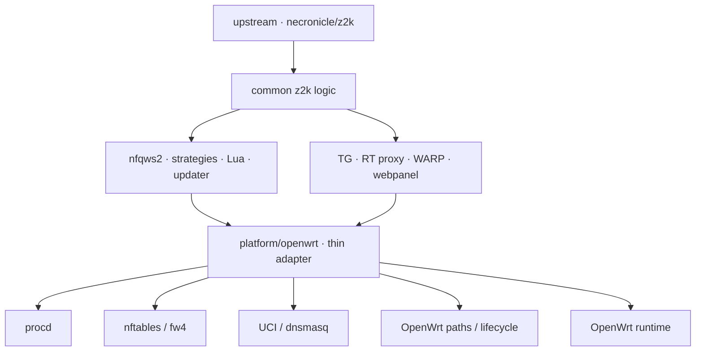
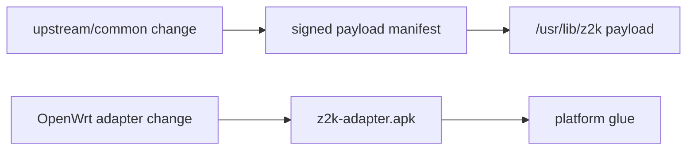

<div align="center">

<h1>z2kOW</h1>

<p><strong>z2k для OpenWrt без отдельного форка runtime</strong></p>

[](https://github.com/t0fox/z2kOW/actions/workflows/ci.yml)
[](https://openwrt.org/)
[](./docs/openwrt-adapter-contract.md)
[](./package/openwrt/)
[](./LICENSE)

<p>
  <a href="./docs/openwrt-adapter-contract.md"><strong>Архитектура OpenWrt</strong></a>
  ·
  <a href="./docs/openwrt-release-contract.md"><strong>Release contract</strong></a>
  ·
  <a href="https://github.com/t0fox/z2kOW/actions/workflows/ci.yml"><strong>CI</strong></a>
  ·
  <a href="https://github.com/necronicle/z2k"><strong>Upstream z2k</strong></a>
</p>

</div>

> [!IMPORTANT]
> **Текущий статус — release candidate для live acceptance.** Реальные APK уже собираются OpenWrt SDK 25.12.5, проходят resolver/feed/CI-проверки и устанавливаются в isolated root. Проверка на реальном Cudy WR3000 v1 — следующий этап. До её завершения CI snapshot не считается публичным production-релизом.

## О проекте

**z2kOW** — OpenWrt-адаптация [necronicle/z2k](https://github.com/necronicle/z2k), построенная не как отдельный порт, а как тонкий слой совместимости платформы.

Общая логика z2k остаётся общей: стратегии, Lua, autocircular, детекторы, Telegram/RT/WARP-компоненты, updater и webpanel не получают отдельные OpenWrt-копии. Различия платформы вынесены в adapter, который переводит ожидаемые z2k-операции в native-механизмы OpenWrt.

Основные принципы:

- **upstream-first** — common logic обновляется вместе с z2k, а не переносится вручную;
- **тонкий platform adapter** — OpenWrt-специфика живёт в `platform/openwrt/*` и package glue;
- **один runtime owner** — firewall, процессы и feature lifecycle не дублируются;
- **два независимых канала обновления** — payload z2k обновляется часто, APK adapter только при изменении platform contract;
- **никакого LuCI-переписывания** — существующий webpanel работает через небольшой compatibility backend.

## Текущее состояние

| Контур | Статус |
|---|:--:|
| Foundation / bootstrap / lifecycle | **PASS** |
| Core z2k + nft/NFQUEUE adapter | **PASS** |
| Telegram + CDN | **PASS** |
| RuTracker RT proxy | **PASS** |
| WARP / split routing | **PASS** |
| Webpanel compatibility layer | **PASS** |
| OpenWrt package / release pipeline | **PASS** |
| Real OpenWrt 25.12.5 SDK build | **PASS** |
| Real APK resolver + `packages.adb` | **PASS** |
| Go verification / reproducible binaries | **PASS** |
| Live Cudy WR3000 v1 | **PENDING** |
| Production feed signing/publication | **PENDING** |

Последний closure CI собрал реальные APK и полностью прошёл все jobs на commit `dca297c`.

## Архитектура



На OpenWrt не появляется второй z2k:

```text
upstream z2k
      │
      │ common logic почти без изменений
      ▼
OpenWrt compatibility layer
      │
      ├── procd вместо Keenetic init
      ├── nft/fw4 вместо platform-specific firewall glue
      ├── UCI/dnsmasq вместо ndmc
      ├── OpenWrt filesystem layout
      ├── package/bootstrap/update glue
      └── mark/PBR translation
```

Именно поэтому обычное обновление upstream не должно превращаться в новый порт.

## Возможности

| Компонент | Что делает |
|---|---|
| **Core z2k** | Запускает zapret2 / `nfqws2`, стратегии и общий lifecycle через procd |
| **nft/NFQUEUE** | Использует единый `inet zapret`, без второго firewall framework |
| **Autocircular** | Общая upstream-логика стратегий без OpenWrt-форка |
| **Telegram + CDN** | Прозрачный TG transport и CDN path через отдельный procd instance |
| **RT proxy** | Прозрачный HTTPS CONNECT path для RuTracker с OpenWrt DNS integration |
| **WARP** | Опциональный split tunnel с внешним OpenWrt networking backend и PBR |
| **Webpanel** | Исходный frontend/CGI z2k через маленький OpenWrt platform seam |
| **Updater** | Подписанный payload update отдельно от APK adapter |
| **Package layer** | Native OpenWrt APK, bootstrap, ownership и lifecycle |

## Что принципиально не форкается

z2kOW не создаёт OpenWrt-копии для:

- Lua и стратегий;
- autocircular и detector logic;
- Telegram client logic;
- RT proxy logic;
- WARP transport logic;
- общего updater/release semantics;
- webpanel frontend и API.

Platform-specific эффекты должны заканчиваться в adapter layer.

## Пакеты

Сейчас CI собирает два APK:

| Пакет | Назначение |
|---|---|
| `z2k-adapter` | Core OpenWrt adapter, lifecycle, seed/bootstrap и platform glue |
| `z2k-webpanel` | Опциональный dedicated lighttpd instance для существующего z2k webpanel |

Текущий воспроизводимый build contract:

| Параметр | Значение |
|---|---|
| OpenWrt | **25.12.5** |
| Target | **`mediatek/filogic`** |
| Package arch | **`aarch64_cortex-a53`** |
| Формат | **APK v3** |
| Adapter API | **1** |
| Test device | **Cudy WR3000 v1** |

CI использует pinned OpenWrt SDK и проверяет package metadata, зависимости, feed index, signature/tamper path и установку в isolated root.

## Быстрый старт

> [!WARNING]
> До завершения live acceptance ниже используется **CI snapshot**, а не production feed. Это путь для тестирования на целевом роутере, не финальная пользовательская установка.

### 1. Скачай CI artifact

Открой зелёный workflow **CI** для ветки `feat/openwrt-adapter` и скачай artifact вида:

```text
z2k-openwrt-CI-SNAPSHOT-<commit>
```

Внутри находятся:

```text
z2k-adapter-<version>.apk
z2k-webpanel-<version>.apk
packages.adb
sha256sums
provenance.json
METADATA.txt
```

### 2. Проверь файлы

Перед передачей на роутер:

```sh
sha256sum -c sha256sums
```

После копирования на роутер сверь SHA256 ещё раз.

### 3. Установи core adapter

Для CI snapshot допускается явная локальная установка unsigned test artifact:

```sh
apk add --allow-untrusted ./z2k-adapter-0.1.0-r1.apk
```

Запуск:

```sh
/etc/init.d/z2k enable
/etc/init.d/z2k start
```

Проверка:

```sh
/etc/init.d/z2k status
ubus call service list '{"name":"z2k"}'
nft list table inet zapret
```

### 4. Установи webpanel при необходимости

```sh
apk add --allow-untrusted ./z2k-webpanel-0.1.0-r1.apk
/etc/init.d/z2k-webpanel enable
/etc/init.d/z2k-webpanel start
```

Webpanel имеет отдельный lifecycle: остановка core z2k не должна выключать сам интерфейс.

## Runtime layout

| Путь | Владелец | Назначение |
|---|---|---|
| `/usr/lib/z2k/` | updater/package | Общий payload и platform runtime |
| `/usr/lib/z2k/platform/openwrt/` | package | OpenWrt compatibility layer |
| `/usr/lib/z2k/bin/` | updater | Runtime binaries |
| `/etc/z2k/config` | user | Основная конфигурация |
| `/etc/z2k/state/` | user/runtime | Persistent state |
| `/etc/z2k/user-lists/` | user | Пользовательские списки |
| `/tmp/z2k/` | transient | Runtime state, logs, generated files |

Package-owned и updater-owned файлы разделены: payload update не должен перезаписывать platform adapter, а APK upgrade не должен откатывать здоровый payload к seed.

## Сеть и ownership

### Firewall

Canonical owner — одна таблица:

```text
inet zapret
```

Core runtime владеет NFQUEUE и базовым flow, feature adapters добавляют только свои узкие chains/sets. Второй nft framework не создаётся.

### Процессы

Один `/etc/init.d/z2k` управляет несколькими procd instances:

```text
core
Telegram/CDN
RT proxy
WARP
```

Webpanel вынесен в отдельный:

```text
/etc/init.d/z2k-webpanel
```

и не связан с lifecycle core-процессов.

## Telegram + CDN

OpenWrt adapter сохраняет общий transport z2k:

```text
:1443  Telegram
:1444  CDN
```

TG/CDN lifecycle принадлежит platform adapter и procd. CGI/webpanel не запускает transport напрямую и не создаёт собственные nft rules.

Подробности: [openwrt-telegram-contract.md](./docs/openwrt-telegram-contract.md).

## RuTracker RT proxy

RT adapter использует существующий upstream proxy и добавляет только OpenWrt networking/DNS integration.

Canonical domains:

```text
rutracker.org
rutracker.wiki
api.rutracker.cc
rep.rutracker.cc
static.rutracker.cc
```

Подробности: [openwrt-rt-proxy-contract.md](./docs/openwrt-rt-proxy-contract.md).

## WARP

WARP остаётся опциональным компонентом.

Сам `z2k-warpd` получил минимальный platform seam:

```text
--net-backend=external
```

При нём engine не поднимает собственный iptables networking, а OpenWrt adapter владеет nft/PBR lifecycle.

Основные параметры:

```text
table 989
mark  0x80000000/0x80000000
pref  500
```

WARP binary не обязан присутствовать после базовой установки и не включается автоматически.

Подробности: [openwrt-warp-contract.md](./docs/openwrt-warp-contract.md).

## Webpanel

z2kOW не делает LuCI-версию панели и не поддерживает отдельный OpenWrt frontend.

Используется существующий webpanel z2k:

```text
upstream webpanel
      ↓
webpanel/cgi/platform.sh
      ↓
platform/openwrt/webpanel.sh
      ↓
existing OpenWrt adapter primitives
```

На OpenWrt панель:

- использует dedicated lighttpd instance;
- не трогает stock OpenWrt lighttpd;
- по умолчанию привязывается к LAN;
- не управляет nft/PBR напрямую;
- вызывает уже существующие TG/WARP/update primitives;
- скрывает Keenetic-only controls, у которых нет эквивалента.

Подробности: [openwrt-webpanel-contract.md](./docs/openwrt-webpanel-contract.md).

## Обновления: два независимых lane

Главная идея release model:



Обычное обновление Lua, стратегий, списков, webpanel assets или common logic:

```text
новый signed payload
→ APK не пересобирается
```

Изменение platform contract:

```text
новый adapter API
→ новый APK
→ только после него payload, который требует новый API
```

Это позволяет обновлять upstream z2k без постоянного ручного переноса OpenWrt-патчей.

Подробности: [openwrt-release-contract.md](./docs/openwrt-release-contract.md).

## CI и воспроизводимость

CI проверяет не только source tests.

В pipeline входят:

- ShellCheck и syntax checks;
- Lua tests;
- Go `gofmt`, `vet`, race tests и cross-compile;
- byte-for-byte reproducibility shipped binaries;
- полный OpenWrt test harness;
- pinned OpenWrt 25.12.5 SDK;
- настоящая APK-сборка;
- APK v3 metadata через `adbdump`;
- настоящий `packages.adb`;
- ephemeral correct-key / wrong-key / tamper verification;
- package resolution и install в isolated APK root.

Host/mock tests не считаются заменой live-router acceptance.

## Разработка

Полный OpenWrt harness:

```sh
sh tests/openwrt/run.sh
```

Канонический package builder:

```sh
sh scripts/openwrt/build-release.sh --ci-snapshot ...
```

OpenWrt manifest generator:

```sh
sh scripts/openwrt/gen-openwrt-manifest.sh ...
```

Не собирай production artifact из dirty tree и не меняй `UPDATES.json` вручную ради feature-ветки.

## Документация

| Документ | Назначение |
|---|---|
| [OpenWrt adapter contract](./docs/openwrt-adapter-contract.md) | Platform boundary, ownership и invariants |
| [Foundation state machine](./docs/openwrt-foundation-state-machine.md) | Seed, marker, tag и lifecycle |
| [Mark allocation](./docs/openwrt-mark-allocation.md) | Разделение fwmark между subsystems |
| [Telegram contract](./docs/openwrt-telegram-contract.md) | TG/CDN networking и lifecycle |
| [RT proxy contract](./docs/openwrt-rt-proxy-contract.md) | RuTracker proxy и DNS semantics |
| [WARP contract](./docs/openwrt-warp-contract.md) | WARP/PBR ownership и fail-open |
| [Webpanel contract](./docs/openwrt-webpanel-contract.md) | Platform seam для существующей панели |
| [Release contract](./docs/openwrt-release-contract.md) | APK/payload lanes, adapter API и release gates |
| [ARCHITECTURE.md](./ARCHITECTURE.md) | Общая upstream архитектура z2k |
| [RELEASING.md](./RELEASING.md) | Общий release lifecycle |
| [SECURITY.md](./SECURITY.md) | Модель доверия и подписи |

## Upstream и связанные проекты

z2kOW существует как OpenWrt platform layer вокруг upstream z2k, а не как попытка заменить его.

| Проект | Связь |
|---|---|
| [necronicle/z2k](https://github.com/necronicle/z2k) | Основной upstream: common runtime, стратегии, updater и webpanel |
| [necronicle/zapret2-z2k](https://github.com/necronicle/zapret2-z2k) | Zapret2 engine / `nfqws2` |
| [OpenWrt](https://openwrt.org/) | Целевая platform |
| [t0fox/zapret2-manager](https://github.com/t0fox/zapret2-manager) | Отдельный OpenWrt manager-проект; не является runtime z2kOW |

Upstream-код сохраняет своё авторство, историю и лицензирование. OpenWrt adapter развивается отдельно только там, где действительно требуется platform-specific behavior.

## Лицензия

Проект распространяется по лицензии **MIT**. Подробности — в [LICENSE](./LICENSE).

---

<div align="center">

<strong>z2kOW</strong>

<sub>upstream z2k · thin OpenWrt adapter · native APK</sub>

</div>
