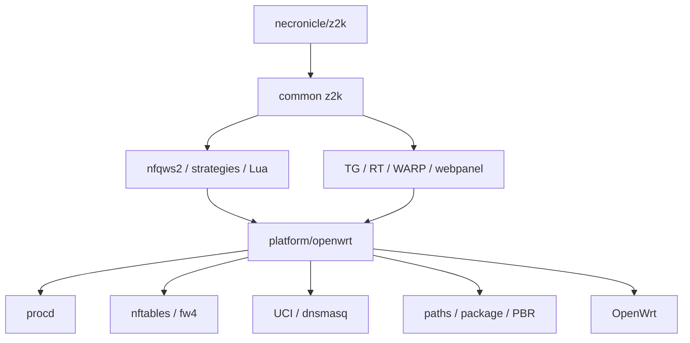

<div align="center">

<h1>z2kOW</h1>

<p><strong>z2k для OpenWrt через тонкий platform adapter</strong></p>

[](https://github.com/t0fox/z2kOW/actions/workflows/ci.yml)
[](https://openwrt.org/)
[](./docs/openwrt-adapter-contract.md)
[](./package/openwrt/)
[](./LICENSE)

<p>
  <a href="#быстрый-старт"><strong>Быстрый старт</strong></a>
  ·
  <a href="#как-пользоваться-z2k"><strong>Гайд</strong></a>
  ·
  <a href="./docs/openwrt-adapter-contract.md"><strong>Архитектура</strong></a>
  ·
  <a href="https://github.com/t0fox/z2kOW/actions/workflows/ci.yml"><strong>CI</strong></a>
</p>

</div>

> [!IMPORTANT]
> Сейчас z2kOW находится на этапе **live acceptance**. Реальные APK уже собираются pinned OpenWrt SDK 25.12.5 и полностью проходят CI, resolver и isolated-root install. Следующий этап — проверка на реальном Cudy WR3000 v1. До неё CI snapshot считается тестовой сборкой, а не публичным production-релизом.

## Что это

**z2kOW** — OpenWrt-адаптация [necronicle/z2k](https://github.com/necronicle/z2k), сделанная не как отдельный форк, а как слой совместимости платформы.

Общая логика z2k остаётся общей:

- стратегии и autocircular;
- Lua;
- списки;
- Telegram transport;
- RT proxy;
- WARP engine;
- updater;
- webpanel.

OpenWrt-специфика вынесена отдельно:

- `procd` вместо Keenetic init;
- `nftables/fw4` вместо platform-specific firewall glue;
- `UCI/dnsmasq` вместо `ndmc`;
- OpenWrt paths;
- APK/package lifecycle;
- PBR/mark translation.

Идея проекта простая:

```text
upstream z2k
      │
      │ common logic почти без изменений
      ▼
OpenWrt compatibility adapter
      │
      ├── procd
      ├── nft/fw4
      ├── UCI/dnsmasq
      ├── OpenWrt filesystem
      └── package/update glue
```

## Текущее состояние

| Контур | Статус |
|---|:--:|
| Foundation / bootstrap / lifecycle | **PASS** |
| Core z2k + nft/NFQUEUE | **PASS** |
| Telegram + CDN | **PASS** |
| RuTracker RT proxy | **PASS** |
| WARP | **PASS** |
| Webpanel | **PASS** |
| Real APK build | **PASS** |
| `packages.adb` + resolver | **PASS** |
| Go / reproducible binaries | **PASS** |
| Live Cudy WR3000 v1 | **PENDING** |
| Production feed/signing | **PENDING** |

Последний полностью зелёный CI: commit `dca297c`.

---

# Быстрый старт

> [!WARNING]
> До завершения live acceptance ниже используется **CI snapshot**. Для него допустим локальный `--allow-untrusted`. Это не финальная схема production-установки.

## 1. Совместимость

Текущий build contract:

| Параметр | Значение |
|---|---|
| OpenWrt | **25.12.5** |
| Target | **`mediatek/filogic`** |
| Arch | **`aarch64_cortex-a53`** |
| Package format | **APK v3** |
| Test device | **Cudy WR3000 v1** |
| Adapter API | **1** |

## 2. Скачай CI artifact

Открой зелёный workflow **CI** для `feat/openwrt-adapter` и скачай artifact вида:

```text
z2k-openwrt-CI-SNAPSHOT-<commit>
```

Внутри:

```text
z2k-adapter-0.1.0-r2.apk
z2k-webpanel-0.1.0-r2.apk
z2k-zapret2-runtime-1.0.5.1-r2.apk
packages.adb
sha256sums
provenance.json
METADATA.txt
```

Перед установкой сверь SHA256.

## 3. Установи core

Скопируй APK на роутер и выполни:

```sh
apk add --allow-untrusted ./z2k-adapter-0.1.0-r2.apk
```

Затем:

```sh
/etc/init.d/z2k enable
/etc/init.d/z2k start
```

Быстрая проверка:

```sh
/etc/init.d/z2k status
ubus call service list '{"name":"z2k"}'
nft list table inet zapret
```

## 4. Установи webpanel

```sh
apk add --allow-untrusted ./z2k-webpanel-0.1.0-r2.apk
/etc/init.d/z2k-webpanel enable
/etc/init.d/z2k-webpanel start
```

По умолчанию панель слушает LAN-адрес роутера на:

```text
http://<LAN-IP>:8088
```

Stock lighttpd OpenWrt не используется и не перенастраивается — у панели свой dedicated instance.

---

# Как пользоваться z2k

Ниже — именно пользовательский гайд z2k, но уже для OpenWrt.

## Основное управление

| Действие | Команда |
|---|---|
| Старт | `/etc/init.d/z2k start` |
| Стоп | `/etc/init.d/z2k stop` |
| Рестарт | `/etc/init.d/z2k restart` |
| Reload | `/etc/init.d/z2k reload` |
| Статус | `/etc/init.d/z2k status` |
| Автозапуск включить | `/etc/init.d/z2k enable` |
| Автозапуск выключить | `/etc/init.d/z2k disable` |

Главный конфиг:

```text
/etc/z2k/config
```

Persistent state:

```text
/etc/z2k/state/
```

Пользовательские списки и кастомные настройки:

```text
/etc/z2k/user-lists/
```

Runtime/logs:

```text
/tmp/z2k/
```

## Что происходит при старте

`/etc/init.d/z2k` выполняет один общий lifecycle:

```text
bootstrap
  ↓
генерация config
  ↓
nfqws2
  ↓
nft/NFQUEUE
  ↓
Telegram/CDN
  ↓
RT proxy
  ↓
WARP desired-state
```

Все процессы принадлежат одному procd-сервису `z2k`.

## Webpanel

Панель остаётся той же по логике, что upstream z2k: frontend и CGI не переписаны под LuCI.

На OpenWrt добавлен только adapter:

```text
upstream webpanel
      ↓
webpanel/cgi/platform.sh
      ↓
platform/openwrt/webpanel.sh
      ↓
procd / nft / UCI / existing feature adapters
```

Через панель доступны:

- статус core;
- start/stop/restart;
- стратегии;
- whitelist;
- extra domains;
- исключения;
- custom strategies;
- Telegram;
- WARP;
- проверка/применение обновлений;
- состояние updater;
- neighbor list для WARP.

Keenetic-only controls, у которых нет OpenWrt-эквивалента, не эмулируются фальшиво:

| Функция | OpenWrt |
|---|:--:|
| Keenetic policy | Нет |
| PPE toggle Keenetic | Нет |
| Full uninstall из браузера | Нет |
| WARP | Да |
| Telegram | Да |

Полное удаление делается пакетным менеджером, а не CGI.

---

# Стратегии и autocircular

Главная логика z2k здесь такая же, как upstream.

Для разных типов трафика используются отдельные strategy pools:

- RKN / обычный TCP/TLS;
- YouTube TCP;
- GoogleVideo TCP;
- YouTube QUIC;
- Discord UDP.

В профиле может быть несколько стратегий:

```text
strategy=1
strategy=2
strategy=3
...
```

Модуль `circular` отслеживает успех и неудачи и при необходимости переходит к следующему варианту.

### Что это значит для пользователя

После первого запуска сайт не обязан заработать именно с первой попытки.

Если конкретный домен попал под autocircular, z2k может потребоваться несколько соединений, чтобы подобрать рабочую стратегию.

То есть нормальный сценарий:

```text
первый запрос не прошёл
→ circular считает неудачу
→ следующий strategy
→ новый запрос
→ успешный strategy закрепился
```

Состояние сохраняется в persistent state и переживает рестарты:

```text
/etc/z2k/state/state.tsv
```

Поэтому после обучения система не должна начинать подбор заново при каждом reboot.

## Custom strategies

Пользовательские стратегии на OpenWrt хранятся отдельно от updater-owned payload:

```text
/etc/z2k/user-lists/custom-strategies/
```

Они не должны исчезать после обычного update или APK upgrade.

Если custom strategy задана для конкретного pool, она перекрывает shipped strategy этого pool.

---

# Домены, whitelist и исключения

Updater-owned списки:

```text
/usr/lib/z2k/lists/
```

Пользовательские:

```text
/etc/z2k/user-lists/
```

Основные файлы:

| Файл | Назначение |
|---|---|
| `/etc/z2k/user-lists/extra-domains.txt` | Домены, которые нужно добавить в обработку |
| `/etc/z2k/user-lists/whitelist.txt` | Домены, которые не нужно обходить |
| `/etc/z2k/user-lists/exclude.txt` | Пользовательские исключения |
| `/etc/z2k/user-lists/custom-strategies/` | Собственные стратегии |
| `/etc/z2k/user-lists/warp/` | WARP lists/devices |

Эти файлы — user-owned. Updater не должен затирать их shipped-версиями.

Править их руками можно: одна запись на строку, комментарии после `#` и пустые строки не мешают.

После изменения через webpanel нужный reload/restart выполняется самим backend.

---

# Telegram + CDN

Telegram реализован как отдельный procd instance внутри сервиса z2k.

Один `tg-mtproxy-client` обслуживает:

```text
:1443  Telegram
:1444  CDN
```

Вручную клиентские устройства настраивать не нужно — adapter делает transparent routing.

Управлять проще всего из webpanel.

Ручной флаг:

```text
TG_PROXY_USER_DISABLED=0   # включено
TG_PROXY_USER_DISABLED=1   # выключено
```

в:

```text
/etc/z2k/config
```

После изменения:

```sh
/etc/init.d/z2k reload
```

Проверка процесса:

```sh
ubus call service list '{"name":"z2k"}'
```

Telegram adapter не создаёт вторую nft-таблицу — его chains/sets живут внутри `inet zapret`.

---

# RuTracker RT proxy

RT proxy — first-class feature того же core lifecycle.

Поддерживаемые домены:

```text
rutracker.org
rutracker.wiki
api.rutracker.cc
rep.rutracker.cc
static.rutracker.cc
```

IPv4 sentinel:

```text
10.171.171.171
```

IPv6 sentinel:

```text
2001:db8::1:1445
```

HTTPS traffic направляется на локальный transparent proxy `:1445`.

Пользователю не нужно отдельно держать второй init-сервис или firewall script: RT запускается и сходится вместе с `z2k`.

---

# WARP

WARP предназначен для трафика, который нельзя нормально обойти только desync-стратегиями — прежде всего IP-based сценариев и игровых сетей.

WARP **не ставится автоматически** вместе с core.

## Установить engine

```sh
/usr/lib/z2k/platform/openwrt/warp.sh install
```

Эта команда:

- скачивает правильный binary для архитектуры;
- регистрирует устройство;
- сохраняет identity;
- не включает routing автоматически.

Identity:

```text
/etc/z2k/state/warp/device.json
```

## Включить

```sh
/usr/lib/z2k/platform/openwrt/warp.sh enable
```

## Статус

```sh
/usr/lib/z2k/platform/openwrt/warp.sh status
```

## Выключить

```sh
/usr/lib/z2k/platform/openwrt/warp.sh disable
```

## Удалить engine

```sh
/usr/lib/z2k/platform/openwrt/warp.sh remove
```

При remove сохраняются:

- device identity;
- user lists.

Маршрутизация WARP:

```text
fwmark 0x80000000/0x80000000
rule pref 500
table 989
```

Если tunnel не ready, adapter fail-open: PBR снимается, dynamic rules очищаются, обычный трафик не должен blackhole'иться.

---

# Обновления

В z2kOW два независимых канала доставки.

## Payload update

Обычные изменения:

- Lua;
- strategies;
- lists;
- common libs;
- webpanel assets;
- binaries;

идут через подписанный z2k updater.

Проверить:

```sh
/usr/lib/z2k/platform/openwrt/update.sh check
```

Применить вручную:

```sh
Z2K_AU_MANUAL=1 /usr/lib/z2k/platform/openwrt/update.sh apply
```

Ручной apply не ждёт nightly jitter.

## Подпись обновлений

Манифест обновлений подписывается, роутер проверяет подпись перед применением. Приватного ключа в репозитории нет.

Публичный ключ едет вместе с установкой (`files/etc/z2k-update-pub.pem`). Его отпечаток:

```
1041720fa0dff53e2babbf547a705c2f43c30bca2c6ca2ddf7144cfe3b470a01
```

Если ключ придётся сменить, установка покажет отпечаток нового ключа — сверьте с этим. Не совпал — не подтверждайте.

## APK update

Если меняется сам OpenWrt adapter:

```text
platform/openwrt/*
init.d
hotplug
package metadata
adapter API
```

нужен новый `z2k-adapter.apk`.

Это происходит значительно реже.

Главное правило:

```text
обычный upstream z2k update
→ НЕ требует пересборки APK
```

---

# Проверка состояния

## Core

```sh
/etc/init.d/z2k status
ubus call service list '{"name":"z2k"}'
```

## nft/NFQUEUE

```sh
nft list table inet zapret
```

## Routes и marks

```sh
ip rule
ip route show table all
```

## Webpanel

```sh
/etc/init.d/z2k-webpanel status
```

Если panel не стартует:

```sh
logread | grep -i z2k
logread | grep -i lighttpd
```

## Updater

```sh
/usr/lib/z2k/platform/openwrt/update.sh check
```

Логи и transient state:

```text
/tmp/z2k/logs/
/tmp/z2k/runtime/
/tmp/z2k/warp/
```

---

# Если сайт не открывается

Порядок проверки:

1. Убедись, что core действительно запущен.
2. Проверь `inet zapret`.
3. Сделай несколько новых соединений/перезагрузок страницы — autocircular может подбирать strategy.
4. Если домена нет в shipped lists, добавь его в:
   ```text
   /etc/z2k/user-lists/extra-domains.txt
   ```
5. Если сайт ломается именно из-за обработки z2k — добавь его в whitelist/exclude.
6. После изменения списка выполни reload через webpanel или:
   ```sh
   /etc/init.d/z2k reload
   ```
7. Посмотри logs:
   ```sh
   logread | grep -i z2k
   ```

Не начинай сразу менять nft rules вручную: firewall state принадлежит adapter/runtime и при следующем converge ручная правка всё равно будет заменена.

---

# Если после включения WARP пропал интернет

Проверь:

```sh
/usr/lib/z2k/platform/openwrt/warp.sh status
ip rule
ip route show table 989
nft list table inet zapret
```

Нормальная fail-open модель:

```text
WARP not ready
→ PBR removed
→ dynamic TUN rules empty
→ обычный интернет продолжает работать
```

Если это не так — это уже runtime defect, а не ожидаемое поведение.

---

# Webpanel не открывается

Проверить:

```sh
/etc/init.d/z2k-webpanel status
logread | grep -i lighttpd
```

По умолчанию порт:

```text
8088
```

Настройки панели:

```text
/etc/z2k/webpanel/
```

Сгенерированный lighttpd config transient:

```text
/tmp/z2k/runtime/webpanel/lighttpd.conf
```

Если `8088` уже занят чужим процессом, z2k-webpanel специально не убивает его и не подменяет конфиг — старт завершается ошибкой.

---

# Удаление и переустановка

Webpanel:

```sh
apk del z2k-webpanel
```

Core:

```sh
apk del z2k-adapter
```

По контракту uninstall сохраняет пользовательские данные:

```text
/etc/z2k/config
/etc/z2k/state/
/etc/z2k/user-lists/
/etc/z2k/webpanel/
```

Это позволяет установить пакет снова и не потерять config, WARP identity и user lists.

После переустановки healthy payload не должен откатываться к старому seed.

---

# Что пока не переносится с Keenetic

Не каждая upstream-кнопка имеет смысл на OpenWrt.

Сейчас намеренно нет отдельной эмуляции:

- Keenetic NDM policy;
- Keenetic PPE toggle;
- full package uninstall из browser;
- Keenetic-specific `ndmc` tools.

Если feature не имеет честного OpenWrt-equivalent, она скрывается/отключается, а не имитируется пустышкой.

---

# Runtime layout

| Путь | Класс | Что лежит |
|---|---|---|
| `/usr/lib/z2k/` | payload | common z2k |
| `/usr/lib/z2k/platform/openwrt/` | package | adapter |
| `/usr/lib/z2k/bin/` | updater | binaries |
| `/etc/z2k/config` | user | config |
| `/etc/z2k/state/` | persistent | autocircular/updater/WARP state |
| `/etc/z2k/user-lists/` | user | whitelist, extra domains, WARP lists |
| `/etc/z2k/webpanel/` | user | настройки panel |
| `/tmp/z2k/` | transient | logs/runtime/downloads/generated |

Package-owned и updater-owned части разделены.

---

# Архитектура



Canonical firewall table:

```text
inet zapret
```

Feature adapters добавляют свои chains/sets в неё, но не создают параллельный firewall framework.

---

# CI и сборка

CI проверяет:

- ShellCheck;
- Lua tests;
- Go `gofmt`, `vet`, race tests и cross-compile;
- byte-for-byte reproducibility shipped binaries;
- OpenWrt test harness;
- pinned OpenWrt 25.12.5 SDK;
- real APK build;
- APK v3 metadata;
- `packages.adb`;
- ephemeral signing;
- wrong-key/tamper rejection;
- isolated-root dependency resolution.

Полный OpenWrt harness:

```sh
sh tests/openwrt/run.sh
```

Package builder:

```sh
sh scripts/openwrt/build-release.sh --ci-snapshot ...
```

Manifest generator:

```sh
sh scripts/openwrt/gen-openwrt-manifest.sh ...
```

---

## Огромная благодарность спонсорам проекта

- **SupWgeneral**
- **Alexey**
- **Jet_sk_ya**
- **Suharik39**
- **ZyaK<-**
- **Алексей Стрельцов**
- **Diman86RUS**
- **Alex**
- **GRM**
- **Dez**
- **hoaxx**
- **Mansurchick**
- **Dkarloff - SEO отец**
- **KIBERPANK**
- **olmer2002**
- **TiaMax**
- **Denis**
- **Mega Man**
- **TheGreatYogo**
- **logistik77**
- **b11d11**
- **BloodKnife39**

# Документация

| Документ | Назначение |
|---|---|
| [OpenWrt adapter contract](./docs/openwrt-adapter-contract.md) | Platform boundary и ownership |
| [Foundation state machine](./docs/openwrt-foundation-state-machine.md) | Seed/tag/bootstrap |
| [Mark allocation](./docs/openwrt-mark-allocation.md) | fwmark allocation |
| [Telegram contract](./docs/openwrt-telegram-contract.md) | TG/CDN |
| [RT proxy contract](./docs/openwrt-rt-proxy-contract.md) | RuTracker |
| [WARP contract](./docs/openwrt-warp-contract.md) | WARP/PBR |
| [Webpanel contract](./docs/openwrt-webpanel-contract.md) | Panel adapter |
| [Release contract](./docs/openwrt-release-contract.md) | APK/payload lanes |
| [ARCHITECTURE.md](./ARCHITECTURE.md) | Общая архитектура z2k |
| [RELEASING.md](./RELEASING.md) | Release lifecycle |
| [SECURITY.md](./SECURITY.md) | Trust/signature model |

---

# Upstream и связанные проекты

| Проект | Связь |
|---|---|
| [necronicle/z2k](https://github.com/necronicle/z2k) | Основной upstream |
| [necronicle/zapret2-z2k](https://github.com/necronicle/zapret2-z2k) | `nfqws2` / zapret2 runtime |
| [OpenWrt](https://openwrt.org/) | Целевая платформа |
| [t0fox/zapret2-manager](https://github.com/t0fox/zapret2-manager) | Отдельный OpenWrt manager-проект |

z2kOW не пытается заменить upstream z2k. Его задача — дать z2k OpenWrt-платформу с минимальным количеством локальных platform seams.

## Лицензия

MIT. См. [LICENSE](./LICENSE).

---

<div align="center">

<strong>z2kOW</strong>

<sub>upstream z2k · thin OpenWrt adapter · native APK</sub>

</div>
